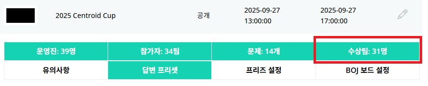

# 대회 종료
- 본 문서는 대회 종료 후 필요한 사항들을 서술한 문서입니다.

## 목차
- 수상팀 작성
- (오프라인) 휴식
- (오프라인, 선택) 후원사 세션 진행
- (오프라인) 풀이 해설
- (오프라인) 스코어보드 공개
- (오프라인) 시상
- (오프라인) 단체 사진 촬영
- (오프라인) 뒷정리
- 에디토리얼 업로드
- 기타

## 수상팀 작성
- 휴식 시간 및 후원사 세션 진행 시간동안 작성을 완료해야 합니다.
- BOJ Stack의 대회탭에서 수상팀을 눌러서 수상팀을 지정할 수 있습니다.

{ width=85% }

## (오프라인) 휴식
- 문제 풀이 및 시상 시간을 고지하고 참가자들에게 쉬는 시간을 제공해야 합니다. (최대 30분)

## (오프라인, 선택) 후원사 세션 진행
- 후원사 홍보 세션이 있다면 후원사 세션을 진행합니다.

## (오프라인) 풀이 해설
- 풀이 해설은 각 문제의 출제자가 풀이를 띄워두고 해설하는 것이 좋습니다.

## (오프라인) 스코어보드 공개
- 수상팀 작성을 완료했다면 어워드 모드로 스코어보드를 공개할 수 있습니다.
- 프리즈가 모두 공개된 팀에게 박수를 치도록 유도하면 좋습니다.
- 조작법은 다음과 같습니다.
	- 다음 : → 키
	- 수상팀 창 닫기 : ESC

## (오프라인) 시상
- 참가자의 상품 수령증이 필요한 경우 수령증을 작성하도록 안내해야 합니다.
- 대회 중 이벤트를 진행했다면 이벤트 결과를 공지하고 수상하도록 합니다.
- 수상자의 경우 사진 작가가 사진을 촬영할 수 있도록 안내합니다.

## (오프라인) 단체 사진 촬영
- 단체 사진을 촬영합니다.

## (오프라인) 뒷정리
- 대회장을 뒷정리하고 분실물 등이 있는지 검토합니다.

## 에디토리얼 업로드
- 대회가 종료된 후 Open Contest의 참가자가 볼 수 있도록 에디토리얼을 업로드합니다.