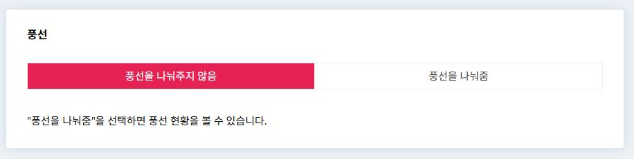
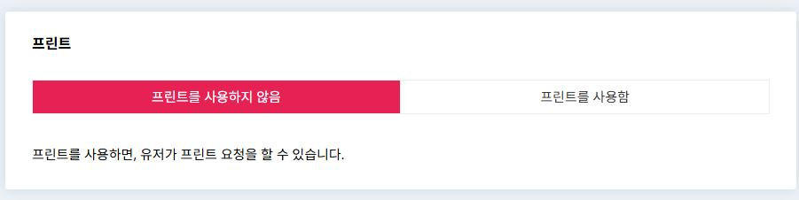
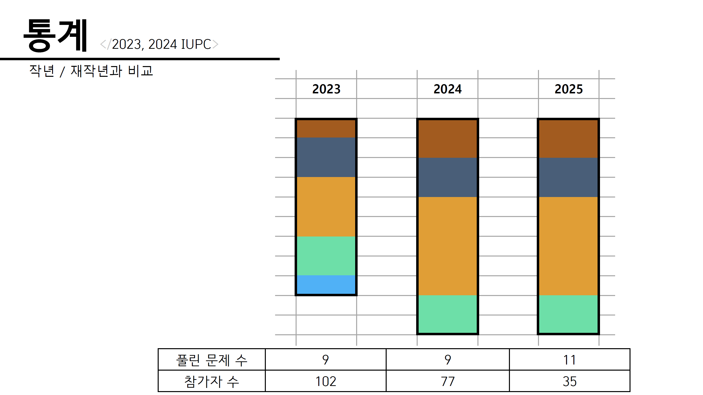
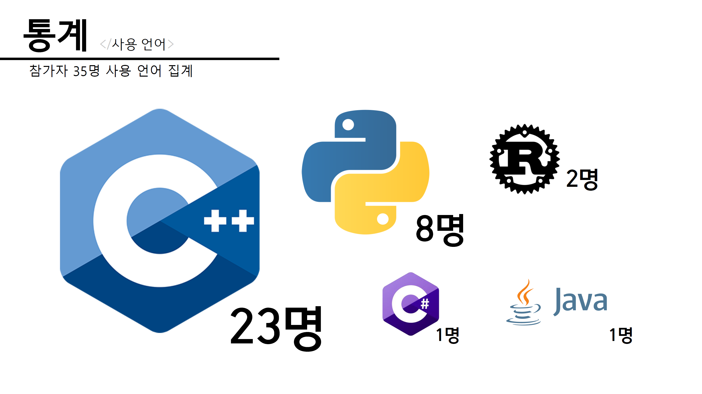
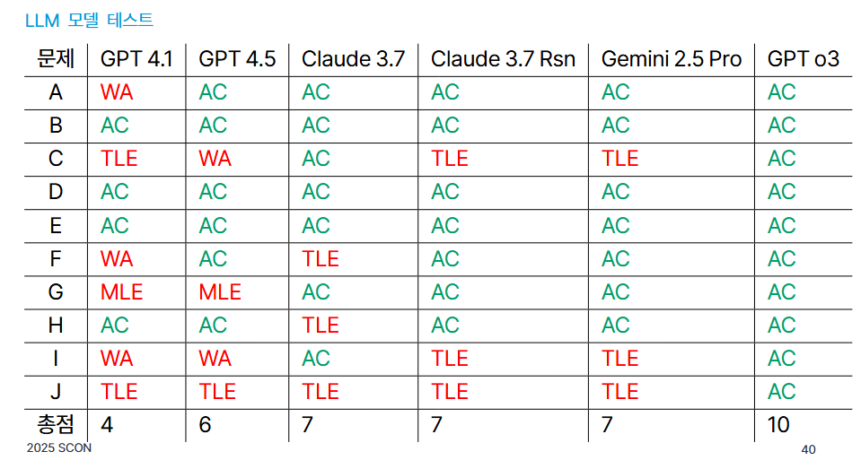

# 대회 현장
- 본 문서는 대회 현장에서 대회 직전 및 대회 중에 필요한 사항들을 서술한 문서입니다.

## 목차
- (오프라인) 참가자 등록
- (오프라인) 대회 주의사항 및 안내사항 전달
- (오프라인) 감독
- (오프라인 + 온라인) 상황실 운영
- 기타

## (오프라인) 참가자 등록
- 참가자 등록은 대회 시작 1시간 이전부터 시작하는 것이 좋습니다.
- 현장 스태프 3명 이상이 아래 역할을 분담하는 것이 좋습니다.
	- 참가자 본인 확인 및 명찰 배부
		- 이때 본인 확인을 위해 학생증, 주민등록증, 혹은 그에 준하는 신분증을 제시하도록 하면 됩니다.
	- 굿즈 배부
	- 팀노트 검사 (필요하다면)
- 등록 시간 이후에 도착한 참가자들에 대한 등록은 기본적으로 불허해야 하나 대회 사정에 따라 허가할 수 있습니다.

## (오프라인) 대회 주의사항 및 안내사항 전달
- 대회 주의사항 안내 시 참가자 전체가 집중해서 들을 수 있도록 해야 합니다.
- 대표적으로 대회 주의사항 안내 시 다음 내용을 안내해야 합니다.
	- 인터넷 사용 가능 여부
		- 각 언어 공식 레퍼런스만 허용할 지, 아니면 전체 가능하게 할지, 아예 불가하게 할지 미리 정해두어야 합니다.
	- 생성형 AI를 이용한 코드 작성 가능의 범위, 혹은 사용 가능 여부
		- 함수 자동완성, 코드의 부분 자동완성 등 어디까지 허용할 것인지, 아예 금지할 것인지를 미리 정해두어야 합니다.
			- `python`에서 `for`를 입력했을 때 입력한 code를 분석해서 `for i in range(N): func(i)`이 자동완성 되는 IDE가 있습니다.
		- 확실하게 정해두지 않으면 추후에 부정행위로 처리할지에 대한 여부를 확실하게 정할 수 없습니다.
	- 휴대용 전자기기의 전원 종료
	- 다과, 음료 안내
	- 인터넷 사용 방법 안내
	- 문제지가 있다면, 문제지의 오류/파손등이 발생한 경우의 어떻게 해야하는 지
	- 화장실 이용 방법
	- 대회 문제, 기타 사항에 대한 문의 방법
	- 스코어보드 프리즈가 있다면, 스코어보드 프리즈에 대한 안내
	
## (오프라인) 감독
- 문제와 관련된 질문은 무조건 BOJ의 대회 질문 기능을 사용하도록 안내합니다. (BOJ를 사용하는 경우)
- 문제와 관련 없는 질문은 현장에 있는 감독관이 유동적으로 처리합니다.
	- 예시 ) 화장실, 멀티탭, 충전기 대여, 아이디 및 비밀번호 요청, 중도 포기 등
- 사진 촬영 담당자는 사진을 다양한 구도로 촬영합니다.

### 중도 포기
- 중도 포기자는 상위권에 입상하거나 특별상 대상이 되더라도 수상하지 못함을 고지해야 합니다.
- 대회가 끝나기 전에 외부 소통등을 통한 문제 유출이 금지됨을 고지해야 합니다.

### (선택) 풍선 전달
- BOJ Stack에서 풍선 기능을 활성화하는 경우, BOJ상에서 여는 대회에서 풍선 기능을 활용할 수 있습니다.

{ width=85% }

### (선택) 코드 프린트물 전달
- BOJ Stack에서 프린트 기능을 활성화하는 경우, BOJ상에서 여는 대회에서 프린트 기능을 활용할 수 있습니다.
	- 참가자가 프린트 요청시 대회에 설치된 프린터에서 코드를 인쇄할 수 있도록 하는 기능입니다.

{ width=85% }

- 다른 팀 혹은 참가자에게 코드 인쇄물을 전달하지 않도록 유의해야 합니다.
- 참가자 자리표를 현장 스태프가 알 수 있도록 해야합니다.

## (오프라인 + 온라인) 상황실 운영
- 참가자가 상황실에 입장하지 않도록 방지해야 합니다.
- 스코어보드 프리즈가 존재한다면, 스코어보드가 프리즈 되는 시점에 프리즈가 되었음을 공지해야 합니다.
- 디스코드 채널에서 문제와 관련된 질문과 관련된 webhook 알림이 온다면 BOJ의 경우 질문 기능을 통해 답변해야 합니다.
	- 답변은 해당 문제의 출제자가 우선적으로 답변하되, 부재시에는 해당 문제를 검수한 사람이 최대한 빨리 답변해야 합니다.
	- 문제 풀이에 영향을 주는 답변은 가급적이면 답변하지 않아야 하고, 답변이 필요한 경우에는 답변을 공개 처리해서 답변해야 합니다.
		- 답변을 공개해야 하는 질문 예시 )
			- Q : 이 문제에서 $N$의 범위가 잘못 주어져있습니다. $N$은 홀수라고 문제 지문에 주어져 있는데 예제에는 $N$이 짝수입니다.
				- 해당 경우에는 문제의 지문 혹은 데이터를 수정하고 이를 답변할 때 공개 처리 해야합니다.
		- 답변을 공개하지 않는 질문 예시 )
			- Q : 컴파일 에러는 패널티에 포함되나요?
			
- 제출들에 대해 항상 모니터링해야 합니다. 풀이가 맞는 코드여도 문제 세팅이 잘못되어 틀리는 경우가 발생할 수 있습니다.
- **만약 문제 지문, 데이터 등을 수정한 경우에는 공지사항에 이 사실을 알려야 합니다.**
- 대회장에서 발생하는 여러 이슈를 처리할 수 있는 대표자를 정하고, 이슈 발생시 대회장에 있는 감독이 대표자에게 `discord`와 같은 메신저로 이슈를 전달하고, 대표자는 이에 대한 답변 혹은 처리를 담당해야 합니다.

### 로테이션 설정
- 인원이 충분한 경우 30분에서 1시간 단위로 대회 현장에서 감독할 사람을 교대하면서 감독하는 것이 좋습니다.

### 에디토리얼 퍼스트 솔브(First Solve) / 통계 작성
- 스코어보드 프리즈 이후 통계 작성을 해야합니다.
	- 오픈 컨테스트(Open Contest)의 에디토리얼(Editorial)은 늦어도 되므로, 본대회 에디토리얼을 시간 내에 작성하는 것이 더 중요합니다.
- 해설 이외 컨텐츠로써 들어갈 만한 것들도 준비하면 좋습니다.
	- 예시 1 ) 작년 대비 난이도 비교
	
		{ width=85% }
		
	- 예시 2 ) 참가자의 사용 언어 통계
	
		{ width=85% }
		
	- 예시 3 ) LLM 모델 테스트
	
		{ width=85% }
		
### 특별상 선정
- 특별상 선정 시에는 아래 두 도메인을 활용하면 쉽게 정보를 수집할 수 있습니다.
	- `https://www.acmicpc.net/contest/board/{대회 번호}/runs.json`
	- `https://www.acmicpc.net/contest/board/{대회 번호}/info.json`

