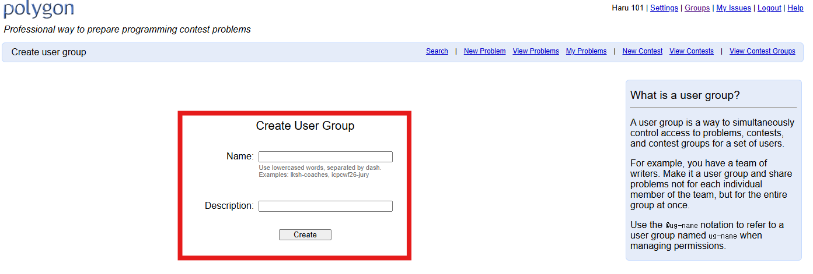
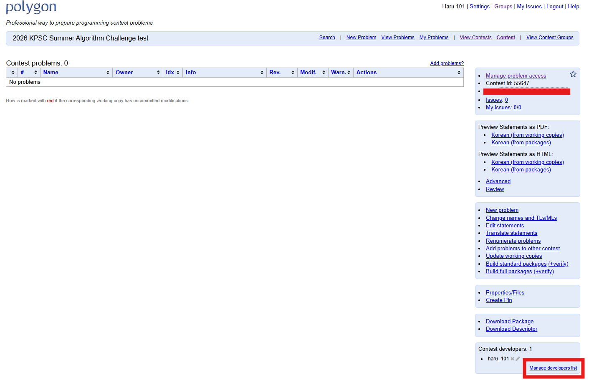
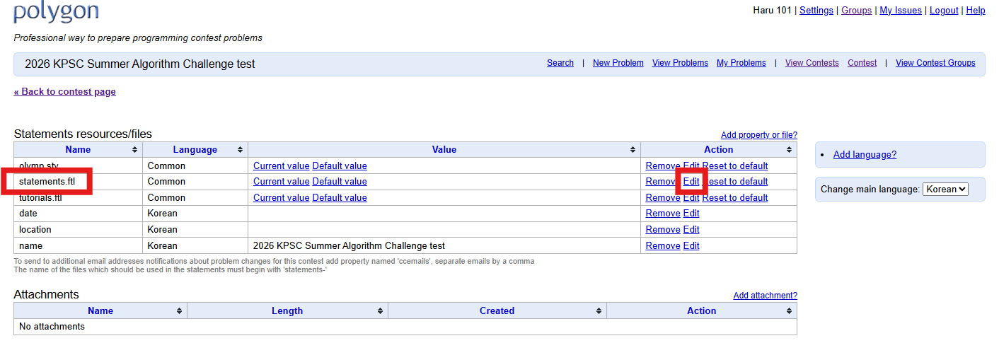

# 출제 및 검수
- 본 문서는 대회 문제를 출제 및 검수하고 Polygon, BOJ Stack에 문제를 세팅하기 까지의 과정을 서술한 문서입니다.

## 목차
- 문제 아이디어 구상
- 문제 선제
- Polygon에서의 대회 세팅
- Polygon에서의 문제 세팅
- 문제 내부 검수
- 문제 외부 검수
- BOJ Stack 세팅
- 기타

## 문제 아이디어 구상
- 문제를 처음 만들어보는 분들은 SCAMPER 기법을 사용해 보는 것이 좋습니다.
### SCAMPER 기법과 그 예시
|방법|설명|예시|
|:--:|:-------------------:|:--:|
|Substitute|기존 문제에서 대체할 요소 찾기|정수를 실수로 대체 [#BOJ 30242](https://www.acmicpc.net/problem/30242) -> [#BOJ 30246](https://www.acmicpc.net/problem/30246) 선형 공간을 트리 공간으로 대체 [#BOJ 13323](https://www.acmicpc.net/problem/13323) -> [#BOJ 12736](https://www.acmicpc.net/problem/12736) 사용하는 객체를 대체 [#BOJ 11726](https://www.acmicpc.net/problem/11726) -> [#BOJ 33675](https://www.acmicpc.net/problem/33675) 사용하는 언어를 대체 [#BOJ 4062](https://www.acmicpc.net/problem/4062) -> [#BOJ 1962](https://www.acmicpc.net/problem/1962)|
|Combine|서로 다른 문제들을 강제로 합치기|이분탐색 + 볼록 껍질 + 다각형 넓이 [#BOJ 27947](https://www.acmicpc.net/problem/27947) 이분 탐색 + BFS/DFS [#BOJ 15573](https://www.acmicpc.net/problem/15573) 스도쿠 + 최대 공약수 [#BOJ 29759](https://www.acmicpc.net/problem/29759) 피타고라스의 정리 + 최소 스패닝 트리 [#BOJ 28297](https://www.acmicpc.net/problem/28297)|
|Adjust/Adapt|일상에서 접하는 것을 주제로 문제 만들기|대회 문제 순서 정렬하기 [#BOJ 33683](https://www.acmicpc.net/problem/33683) [Solved.ac](https://solved.ac/) 스트릭 기능 [#BOJ 29752](https://www.acmicpc.net/problem/29752) 지하철 노선 [#BOJ 30040](https://www.acmicpc.net/problem/30040) OEIS 사이트 아이콘에 있는 수열 [#BOJ 32172](https://www.acmicpc.net/problem/32172)|
|Modify, Magnify/Minify|기존 문제를 변형/확장/축소|변수 제한 낮추기/올리기 [#BOJ 27876](https://www.acmicpc.net/problem/27876) -> [#BOJ 27877](https://www.acmicpc.net/problem/27877) 메모리 제한 낮추기/올리기 [#BOJ 9252](https://www.acmicpc.net/problem/9252) -> [#BOJ 18438](https://www.acmicpc.net/problem/18438) 시간 제한 낮추기/올리기 [#BOJ 1711](https://www.acmicpc.net/problem/1711) -> [#BOJ 3008](https://www.acmicpc.net/problem/3008) 색상의 수를 올리기 [#BOJ 18122](https://www.acmicpc.net/problem/18122) -> [#BOJ 27743](https://www.acmicpc.net/problem/27743)|
|Put to another use|기존 문제를 다른 주제로 활용|LIS를 2차원 평면으로 활용 [#BOJ 12738](https://www.acmicpc.net/problem/12738) -> [#BOJ 23035](https://www.acmicpc.net/problem/23035) 쿼리 문제로 활용 [#BOJ 30991](https://www.acmicpc.net/problem/30991) -> [#BOJ 31987](https://www.acmicpc.net/problem/31987) 주제의 테마를 바꿈 [#BOJ 3621](https://www.acmicpc.net/problem/3621) -> [#BOJ 25596](https://www.acmicpc.net/problem/25596) 기존 수열에서 부분 수열 구하기 [#BOJ 2038](https://www.acmicpc.net/problem/2038) -> [#BOJ 31986](https://www.acmicpc.net/problem/31986)|
|Eliminate|기존 문제에서 일부 요소를 제거|구하고자 하는 값을 제거 [#BOJ 10075](https://www.acmicpc.net/problem/10075) -> [#BOJ 32760](https://www.acmicpc.net/problem/32760) 풀이의 핵심 아이디어를 제거 [#BOJ 12122](https://www.acmicpc.net/problem/12122) -> [#BOJ 32178](https://www.acmicpc.net/problem/32178) 온라인 요소를 제거 [#BOJ 17465](https://www.acmicpc.net/problem/17465) -> [#BOJ 16911](https://www.acmicpc.net/problem/16911) 일부 조건을 제거 [#BOJ 32413](https://www.acmicpc.net/problem/32413) -> [#BOJ 32412](https://www.acmicpc.net/problem/32412)|
|Reverse, Rearrange|기존 문제를 역발상, 재배열하기|연산을 거꾸로 하기 [#BOJ 27738](https://www.acmicpc.net/problem/27738) -> [#BOJ 28142](https://www.acmicpc.net/problem/28142) 데이터 만들기 [#BOJ 19535](https://www.acmicpc.net/problem/19535) -> [#BOJ 19540](https://www.acmicpc.net/problem/19540) 입력과 출력 뒤집기 [#AtCoder DP まとめコンテスト - H](https://atcoder.jp/contests/dp/tasks/dp_h) -> [#BOJ 22980](https://www.acmicpc.net/problem/22980) 일부 조건을 제거 [#BOJ 18795](https://www.acmicpc.net/problem/18795) -> [#BOJ 18796](https://www.acmicpc.net/problem/18796)|

## 문제 선제
### 문제 중복 검사 및 검증
- 문제 아이디어 구상 단계에서 구상한 문제가 이미 다른 대회 등에 출제된 문제일 수 있습니다.
- 아래의 방법들은 이를 판별하기 위한 방법입니다만, 이 방법을 거친다고 해서 100% 중복이 걸러지지 않을 수 있습니다.

|방법|설명|
|:--:|:-------------------:|
|푼 문제 수가 많은 사람에게 물어보기|푼 문제 수가 많으면 구상한 문제와 비슷한 문제를 어딘가에서 봤을 수 있습니다.|
|[AI 사이트 활용](https://yuantiji.ac/en/)|해당 사이트에 구상한 문제의 지문을 입력하면 여러 온라인 저지에서 검색해서 비슷한 문제를 찾아줍니다.|
|직접 검색해보기|문제에 있을 법한 키워드를 백준에서 지문이나 제목을 검색|
|LLM을 이용한 검색|LLM을 이용한 검색 시에는 채팅 기록이 학습에 사용되지 않도록 ChatGPT의 경우에는 [메인 페이지](https://chatgpt.com/)에서 좌하단의 프로필 \> 설정 \> 데이터 제어 \> 모두를 위한 모델 개선을 꺼짐으로 설정하거나 새 채팅에서 우상단의 "임시 채팅 켜기"를 사용해야 합니다.|

### 문제 선정
- 문제 선정 시에는 다음과 같은 사항을 고려해야 합니다.
#### 선제진 선발
- 선제진은 "문제 아이디어 구상" 단계 및 "문제 중복 검사 및 검증"을 거친 문제들에 대해 최종적으로 대회에 사용할 문제를 선정할 사람을 뜻합니다.
- 가장 PS를 잘하는 사람들을 위주로 구성하는 것이 좋습니다.
#### 참가자 수준(배경 지식)
- 예) 고등학생이 풀 수 있는 미적분, 확률과 통계를 바탕으로 한 문제들
- 예2) 대학교에서 열심히 하는 사람은 골드 레벨의 알고리즘 + 플레티넘 레벨 수준의 테크닉을 사용할 수 있음
#### 문제 난이도
  - 대부분의 참가자가 풀 수 있는 문제 (브론즈5 ~ 브론즈4) : 1문제
- 이상적인 문제 셋 : 모든 문제를 푼 팀은 없으나 모든 문제가 한 번씩은 풀려야 함 (흔히 '좌셋'이라 함)
#### 문제 난이도 격차
  - 난이도를 오름차순으로 정렬한 문제셋의 경우 갑자기 문제 난이도가 확 높아지지 않게 하는 것이 좋습니다. (물론 꼭 안되는 것은 아닙니다.)
  - 예) A번 : 브론즈4 -> B번 : 다이아4
#### 태그 분포 및 다양성
  - 대회 컨셉이 아닌 이상은 특정 태그가 과하면 안됩니다.
#### 출제진으로 참여한 운영진이 최소 1문제 이상 풀 수 있도록 하는 것이 좋습니다.
  - 후세대를 위한 출제 작업 인수인계가 필요하기 때문입니다.
  - **출제하고 싶은 문제랑, 출제해야하는 문제를 꼭 타협해야 합니다.**

## Polygon에서의 대회 세팅
### Group 생성

- 우측 상단의 `Groups`의 `Create user group`을 통해 Group을 생성할 수 있습니다.

- `Name`과 `Description`은 원하는 것을 작성하면 됩니다.
  - ex) `Name : 2026 KPSC Summer Algorithm Challenge`, `Description : 2026 KPSC Summer Algorithm Challenge 용 group`

### Contest 생성

- `Name`은 대회의 이름, `Location`, `Date`는 안 적어도 되며, `Main language`는 `Korean`으로 설정하면 됩니다.

- 그 다음, 위의 사진처럼 `Manage developers list`로 진입합니다.

- 그 다음, 위의 사진처럼 `Change list`에는 `@<Group 생성에서 생성한 Group Name>`을 입력하고, `Access`는 `WRITE`로 설정하면 됩니다.
  - 저의 경우 `temp1`이 Group Name이므로 `@temp1`을 입력했습니다.
- 이렇게 하면 그룹에 초대된 모든 사람들이 자동으로 대회의 열람과 편집이 가능합니다.

#### 문제 지문을 PDF 파일로 저장할 경우가 있는 경우

- `statements.ftl` 파일에 대해 `Edit`을 선택합니다.

- 다음 구문을 추가해주세요.
  - `\usepackage {kotex}`

### 알면 좋은 것들
- `Access`를 `READ`로 하는 경우 문제 읽기만 가능하고, 코드 제출이나 문제 수정이 불가합니다. 따라서 기본값을 `WRITE`로 설정하는 것이 좋습니다.
- `Manage developers list`에서 `Group` 기능을 사용하는 경우와 사용하지 않는 경우 다음과 같은 차이가 발생합니다.

|경우|그룹을 **사용하는** 경우|그룹을 **사용하지 않는** 경우|
|:-------------------:|:-------------------:|:-------------------:|
|새로운 인원이 생기는 경우|그룹에 인원 추가만 하면 됩니다.|대회의 `Manage developeres list`에서 일일이 운영진의 `Polygon` 아이디를 기입해야 하고, 권한을 따로 설정해야 합니다.|
|새로운 문제가 추가되는 경우|새로 추가한 문제의 권한을 그룹에만 설정하면 됩니다.|새로 추가한 문제의 권한을 초대한 운영진 아이디 각각마다 개별로 다 설정해주어야 합니다.|

## 문제 세팅
### 출제 세팅
- 공통적으로 **참가자 편의성을 고려해야 합니다.** 참가자가 문제를 푸는 데에 있어 불쾌함을 주어서는 안됩니다.
- 출제를 위한 플랫폼은 보통 `Polygon`을 사용합니다.
- <TODO>

### 지문 (Statement)
- 출제자는 지문을 작성할 때에 다음 항목을 고려해야 합니다.
#### 맞춤법 확인
- 띄어쓰기 및 오타 교정은 기본 중 기본입니다.
- 참가자가 읽을 때에 거슬림이 없어야 합니다.
  - 예) 하루가 조아하는 수를 나타내 는 정수갑 $$N$$이 주어집미다.
#### 이해하기 가장 쉬운 문장으로 작성
- 어떤 상황을 전달하기 위해 여러가지 표현이 있다면, 이해가 가장 쉬운 문장으로 전달해야 합니다.
  - 안 좋은 예) 이 예시를 작성하기 위해서 저는 약 3분간 고민했습니다. 하지만 고민한 끝에도 저는 적당한 예시를 찾을 수 없었습니다. 오 이럴수가. 나의 문장을 멈춰주십시오. 이 문장을 어떻게 잘 작성할 수 있겠소?
  - 좋은 예) 예시 들기 어렵네요.
#### 어떤 단어를 선택할 때, 내가 이 단어의 의미를 정말로 아는지 확인
- 소수 3을 "숫자 3"으로 표현했다면 이는 틀린 표현입니다.
  - **숫자는 수를 표현하기 위한 기호를 뜻합니다.**
- 문자열 $$S$$는 영어로 이루어져 주어진다. 는 틀린 표현입니다.
  - **영어는 언어이며, 문자로 주어지는 것은 (로마자) 알파벳입니다.**
  - 영소문자, 영대문자도 마찬가지로 알파벳 소문자, 알파벳 대문자가 맞는 표현입니다.
- 과일들로만 이루어진 바구니에 감자 $$X$$개와 소고기 $$Y$$팩이 들어있다.
  - 감자는 과일이 아니며 소고기도 과일이 아닙니다.
#### 다른 의미로 해석될 여지가 없는지 고민
- 자연수는 분야에 따라 $$0$$도 자연수에 포함될 수 있습니다.
- 시계 방향은 보는 관점에 따라 반시계 방향이 될 수 있습니다.
- 단순히 수라고 표현하거나 정확한 언급이 없는 경우 정수인지 실수인지 복소수인지 모릅니다.
#### 컨벤션
- 대회 성격에 따라 지문의 서술체를 통일할 필요가 있습니다.
  - 만약 통일하는 경우 컨벤션에 알맞게 지문을 작성해야 합니다.
  - 컨벤션이 없다면 [UCPC 컨벤션](https://github.com/ucpcc/problemsetting-guidelines)을 맞추는 것을 추천합니다.
#### 예외의 경우
- 만약 출제 의도가 있다면 위 규정을 지키지 않아도 됩니다.
  - 예1) [#BOJ 15922](https://www.acmicpc.net/problem/15922)
  - 예Yee) [#BOJ 15643](https://www.acmicpc.net/problem/15643)
#### 참고하면 좋은 문서
- [djm03178님이 작성하신 글](https://infossm.github.io/blog/2021/12/18/checklist/)

### 검증기 (Validator) 작성
- **문제를 세팅할 때 가장 중요한 요소 중 하나 입니다.**
- 검증기가 잘못되면 **문제에 치명적인 요소**로 작용될 수 있으니 꼼꼼히 작성하세요.

### 풀이 (Solution) 작성
- **문제를 세팅할 때 가장 중요한 요소 중 하나 입니다.**
- 풀이가 잘못되면 **문제에 치명적인 요소**로 작용될 수 있으니 꼼꼼히 작성하세요.
- 특히, **출제자는 본인의 풀이의 정당성을 꼼꼼하게 증명**해야 합니다.
  - **Proof by AC는 절대로 해서는 안됩니다.**
- 의도된 풀이보다 쉬운 풀이가 통과되지 않도록 제한을 꼼꼼하게 설정해야 합니다.
