# 대회 문제 세팅 및 검수
- 본 문서는 대회 문제를 출제 및 검수하고 Polygon, BOJ Stack에 문제를 세팅하기 까지의 과정을 서술한 문서입니다.

## 목차
- 문제 아이디어 구상
- 문제 선제
- 문제 세팅
- Polygon에서의 대회 세팅
- Polygon에서의 문제 세팅
- 문제 검수
- 기타

## 문제 아이디어 구상
- 문제를 처음 만들어보는 분들은 SCAMPER 기법을 사용해 보는 것이 좋습니다.

### SCAMPER 기법과 그 예시
|방법|설명|예시|
|:--:|:-------------------:|:--:|
|Substitute|기존 문제에서 대체할 요소 찾기|정수를 실수로 대체   선형 공간을 트리 공간으로 대체   사용하는 언어를 대체|
|Combine|서로 다른 문제들을 강제로 합치기|이분탐색 + 볼록 껍질 + 다각형 넓이   이분 탐색 + BFS/DFS   스도쿠 + 최대 공약수   피타고라스의 정리 + 최소 스패닝 트리|
|Adjust/Adapt|일상에서 접하는 것을 주제로 문제 만들기|대회 문제 순서 정렬하기   [Solved.ac](https://solved.ac/) 스트릭 기능   지하철 노선  OEIS 사이트 아이콘에 있는 수열|
|Modify, Magnify/Minify|기존 문제를 변형/확장/축소|변수 제한 낮추기/올리기   메모리 제한 낮추기/올리기   시간 제한 낮추기/올리기   색상의 수를 올리기|
|Put to another use|기존 문제를 다른 주제로 활용|LIS를 2차원 평면으로 활용   쿼리 문제로 활용  주제의 테마를 바꿈   기존 수열에서 부분 수열 구하기|
|Eliminate|기존 문제에서 일부 요소를 제거|구하고자 하는 값을 제거   풀이의 핵심 아이디어를 제거  온라인 요소를 제거   일부 조건을 제거|
|Reverse, Rearrange|기존 문제를 역발상, 재배열하기|연산을 거꾸로 하기   데이터 만들기   입력과 출력 뒤집기   일부 조건을 제거|

## 문제 선제
### 문제 중복 검사 및 검증
- 문제 아이디어 구상 단계에서 구상한 문제가 이미 다른 대회 등에 출제된 문제일 수 있습니다.
- 아래의 방법들은 이를 판별하기 위한 방법입니다만, 이 방법을 거친다고 해서 100% 중복이 걸러지지 않을 수 있습니다.

|방법|설명|
|:--:|:-------------------:|
|푼 문제 수가 많은 사람에게 물어보기|푼 문제 수가 많으면 구상한 문제와 비슷한 문제를 어딘가에서 봤을 수 있습니다.|
|[AI 사이트 활용](https://yuantiji.ac/en/)|해당 사이트에 구상한 문제의 지문을 입력하면 여러 온라인 저지에서 검색해서 비슷한 문제를 찾아줍니다.|
|직접 검색해보기|문제에 있을 법한 키워드를 백준에서 지문이나 제목을 검색|
|LLM을 이용한 검색|LLM을 이용한 검색 시에는 채팅 기록이 학습에 사용되지 않도록 ChatGPT의 경우에는   [메인 페이지](https://chatgpt.com/)에서 좌하단의 프로필 \> 설정 \> 데이터 제어 \> 모두를 위한 모델 개선을 꺼짐으로 설정하거나 새 채팅에서 우상단의 "임시 채팅 켜기"를 사용해야 합니다.|

### 문제 선정
- 문제 선정 시에는 다음과 같은 사항을 고려해야 합니다.

#### 선제진 선발
- 선제진은 **문제 아이디어 구상** 단계 및 **문제 중복 검사 및 검증**을 거친 문제들에 대해 최종적으로 대회에 사용할 문제를 선정할 사람을 뜻합니다.
- 가장 PS를 잘하는 사람들을 위주로 구성하는 것이 좋습니다.

#### 참가자 수준(배경 지식)
- 예) 고등학생이 풀 수 있는 미적분, 확률과 통계를 바탕으로 한 문제들
- 예2) 대학교에서 열심히 하는 사람은 골드 레벨의 알고리즘 + 플레티넘 레벨 수준의 테크닉을 사용할 수 있음

#### 문제 난이도
- 대부분의 참가자가 풀 수 있는 문제 (브론즈5 ~ 브론즈4) : 1문제
- 이상적인 문제 셋 : 모든 문제를 푼 팀은 없으나 모든 문제가 한 번씩은 풀려야 함 (흔히 '좌셋'이라 함)

#### 문제 난이도 격차
- 난이도를 오름차순으로 정렬한 문제셋의 경우 갑자기 문제 난이도가 확 높아지지 않게 하는 것이 좋습니다. 물론 꼭 안되는 것은 아닙니다.
	- 예) A번 : 브론즈4 -> B번 : 다이아4
	
#### 태그 분포 및 다양성
- 대회 컨셉이 아닌 이상은 특정 태그가 과하지 않는 것을 권장합니다. 물론 아예 안되는 것은 아닙니다.

#### 출제진이 1문제 이상 출제
- 출제진으로 참여한 운영진이 최소 1문제 이상 출제할 수 있도록 하는 것이 좋습니다.
- 후세대를 위한 출제 작업 인수인계가 필요하기 때문입니다.

#### 문제 타협
- **출제하고 싶은 문제랑, 출제해야하는 문제를 꼭 타협해야 합니다.**

## 문제 세팅
### 출제 세팅
- 공통적으로 **참가자 편의성을 고려해야 합니다.** 참가자가 문제를 푸는 데에 있어 불쾌함을 주어서는 안됩니다.
- 출제를 위한 플랫폼은 보통 `Polygon`을 사용하고, 검수가 어느정도 완료된 이후에는 다양한 Online Judge를 사용하면 됩니다.

### 지문 (Statement)
- 출제자는 지문을 작성할 때에 다음 항목을 고려해야 합니다.

#### 맞춤법 확인
- 띄어쓰기 및 오타 교정은 기본 중 기본입니다.
- 참가자가 읽을 때에 거슬림이 없어야 합니다.
	- 예) 하루가 조아하는 수를 나타내 는 정수갑 $N$이 주어집미다.
	
#### 이해하기 가장 쉬운 문장으로 작성
- 어떤 상황을 전달하기 위해 여러가지 표현이 있다면, 이해가 가장 쉬운 문장으로 전달해야 합니다.
	- 안 좋은 예) 
		- 이 예시를 작성하기 위해서 저는 약 3분간 고민했습니다. 하지만 고민한 끝에도 저는 적당한 예시를 찾을 수 없었습니다. 오 이럴수가. 나의 문장을 멈춰주십시오. 이 문장을 어떻게 잘 작성할 수 있겠소?
	- 좋은 예) 예시 들기 어렵네요.
	
#### 어떤 단어를 선택할 때, 내가 이 단어의 의미를 정말로 아는지 확인
- 소수 3을 "숫자 3"으로 표현했다면 이는 틀린 표현입니다.
	- **숫자는 수를 표현하기 위한 기호를 뜻합니다.**
- 문자열 $S$는 영어로 이루어져 주어진다. 는 틀린 표현입니다.
	- **영어는 언어이며, 문자로 주어지는 것은 (로마자) 알파벳입니다.**
	- 영소문자, 영대문자도 마찬가지로 알파벳 소문자, 알파벳 대문자가 맞는 표현입니다.
- 과일들로만 이루어진 바구니에 감자 $X$개와 소고기 $Y$팩이 들어있다.
	- 감자는 과일이 아니며 소고기도 과일이 아닙니다.
	
#### 다른 의미로 해석될 여지가 없는지 고민
- 자연수는 분야에 따라 $0$도 자연수에 포함될 수 있습니다.
- 시계 방향은 보는 관점에 따라 반시계 방향이 될 수 있습니다.
- 단순히 수라고 표현하거나 정확한 언급이 없는 경우 정수인지 실수인지 복소수인지 모릅니다.

#### 컨벤션
- 대회 성격에 따라 지문의 서술체를 통일할 필요가 있습니다.
	- 만약 통일하는 경우 컨벤션에 알맞게 지문을 작성해야 합니다.
	- 컨벤션이 없다면 [UCPC 컨벤션](https://github.com/ucpcc/problemsetting-guidelines)을 맞추는 것을 추천합니다.
	
#### 예외의 경우
- 만약 출제 의도가 있다면 위 규정을 지키지 않아도 됩니다.
	
#### 참고하면 좋은 문서
- [djm03178님이 작성하신 글](https://infossm.github.io/blog/2021/12/18/checklist/)

### 검증기 (Validator) 작성
- **문제를 세팅할 때 가장 중요한 요소 중 하나 입니다.**
- 검증기가 잘못되면 **문제에 치명적인 요소**로 작용될 수 있으니 꼼꼼히 작성하세요.

### 풀이 (Solution) 작성
- **문제를 세팅할 때 가장 중요한 요소 중 하나 입니다.**
- 풀이가 잘못되면 **문제에 치명적인 요소**로 작용될 수 있으니 꼼꼼히 작성하세요.
- 특히, **출제자는 본인의 풀이의 정당성을 꼼꼼하게 증명**해야 합니다.
	- **Proof by AC는 절대로 해서는 안됩니다.**
- 의도된 풀이보다 쉬운 풀이가 통과되지 않도록 제한을 꼼꼼하게 설정해야 합니다.
	- 예시 ) $N=100,000$인 문제를 만들었고, 의도가 $O(N)$이지만 $O(N^2)$의 코드가 통과될 수 있는 경우 $N$을 $500,000$으로 늘리기

## Polygon에서의 대회 세팅
### Group 생성
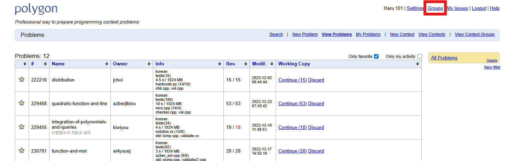
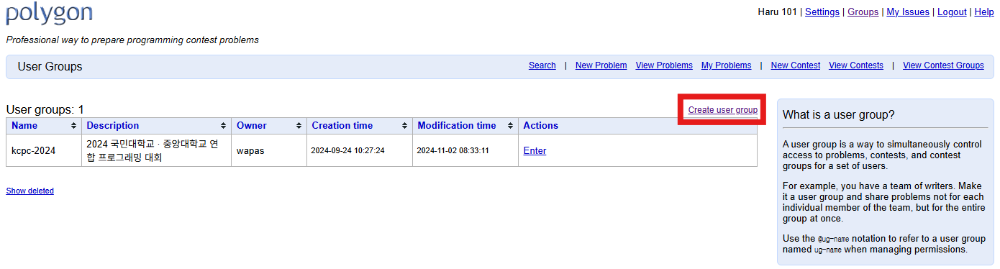

- 우측 상단의 `Groups`의 `Create user group`을 통해 Group을 생성할 수 있습니다.

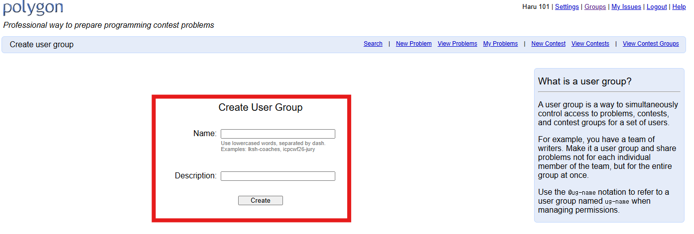

- `Name`과 `Description`은 원하는 것을 작성하면 됩니다.
	- ex) `Name : 2026 KPSC Summer Algorithm Challenge`, `Description : 2026 KPSC Summer Algorithm Challenge 용 group`

### Contest 생성
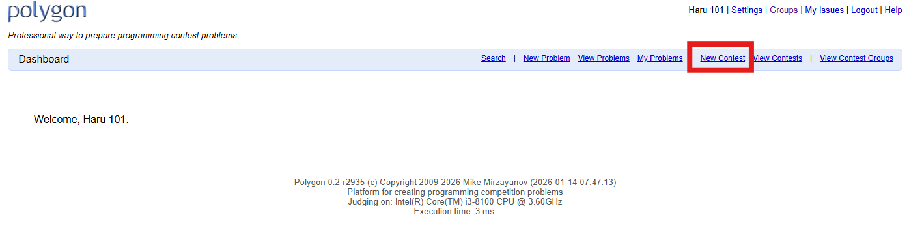
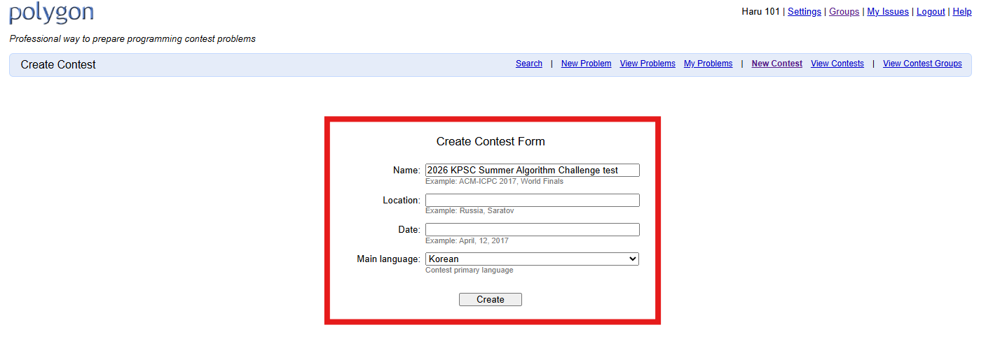

- `Name`은 대회의 이름, `Location`, `Date`는 안 적어도 되며, `Main language`는 `Korean`으로 설정하면 됩니다.

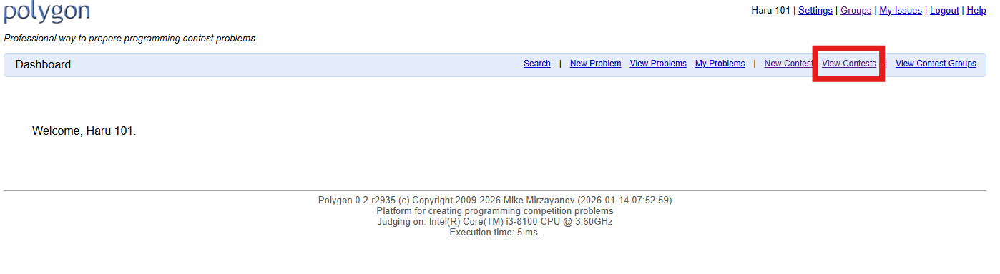
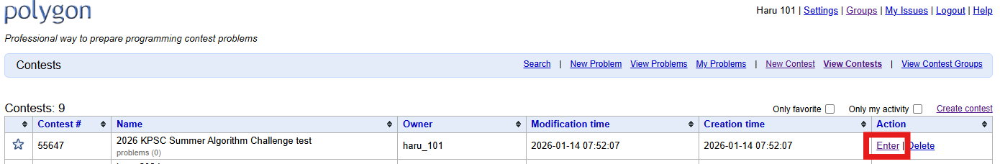
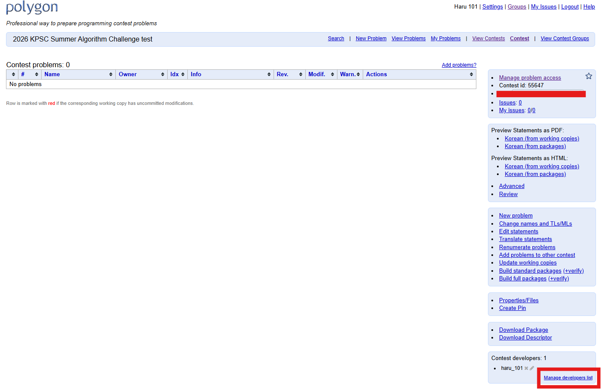

- 그 다음, 위의 사진처럼 `Manage developers list`로 진입합니다.

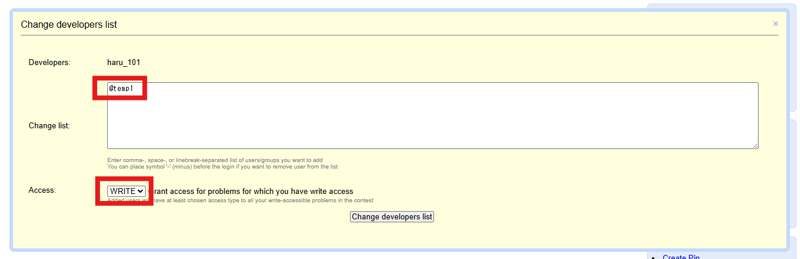

- 그 다음, 위의 사진처럼 `Change list`에는 `@<Group 생성에서 생성한 Group Name>`을 입력하고, `Access`는 `WRITE`로 설정하면 됩니다.
	- 저의 경우 `temp1`이 Group Name이므로 `@temp1`을 입력했습니다.
- 이렇게 하면 그룹에 초대된 모든 사람들이 자동으로 대회의 열람과 편집이 가능합니다.

#### 문제 지문을 PDF 파일로 저장할 경우가 있는 경우
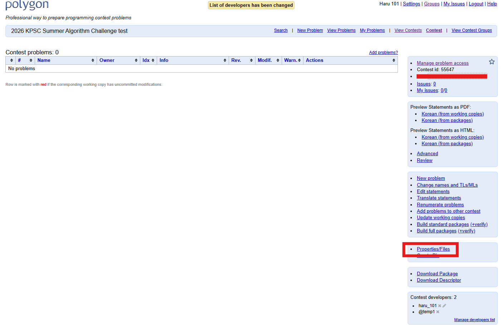
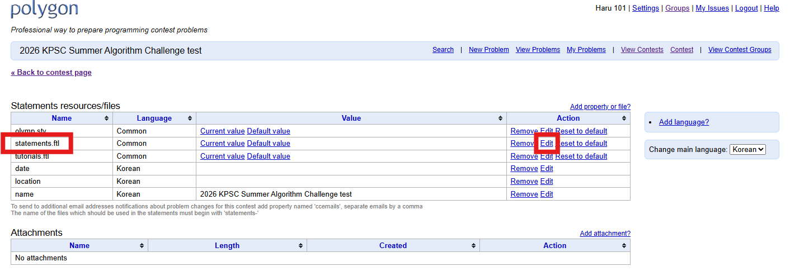

- `statements.ftl` 파일에 대해 `Edit`을 선택합니다.

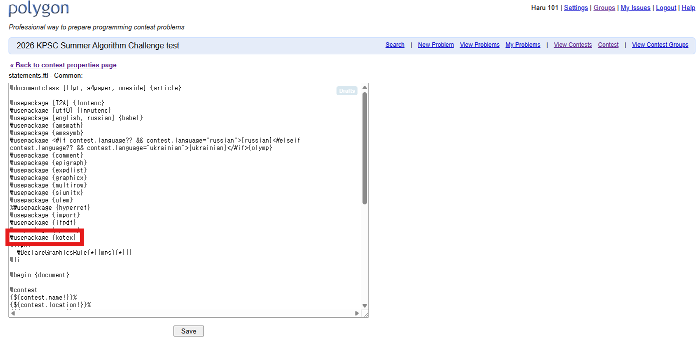

- 다음 구문을 추가해주세요.
	- `\usepackage {kotex}`

### 알면 좋은 것들
- `Access`를 `READ`로 하는 경우 문제 읽기만 가능하고, 코드 제출이나 문제 수정이 불가합니다. 따라서 기본값을 `WRITE`로 설정하는 것이 좋습니다.
- `Manage developers list`에서 `Group` 기능을 사용하는 경우와 사용하지 않는 경우 다음과 같은 차이가 발생합니다.

|경우|그룹을 **사용하는** 경우|그룹을 **사용하지 않는** 경우|
|:-------------------:|:-------------------:|:-------------------:|
|새로운 인원이 생기는 경우|그룹에 인원 추가만 하면 됩니다.|대회의 `Manage developeres list`에서 일일이 운영진의 `Polygon` 아이디를 기입해야 하고, 권한을 따로 설정해야 합니다.|
|새로운 문제가 추가되는 경우|새로 추가한 문제의 권한을 그룹에만 설정하면 됩니다.|새로 추가한 문제의 권한을 초대한 운영진 아이디 각각마다 개별로 다 설정해주어야 합니다.|

## Polygon에서의 문제 세팅
### 참고하면 좋은 글 
- evenharder님이 작성하신 [블로그 글](https://evenharder.tistory.com/2)을 참조하시기 바랍니다.

### 참고사항
- `Java`의 primitive type array의 경우 꽤나 빨라서 실행시간에서 이득을 보는 경우가 있습니다.
	- `Java`를 잘 하는 사람을 찾아보시기 바랍니다.
	- 예시로, [#BOJ 30800](https://www.acmicpc.net/problem/30800)의 경우 이로 인해 시간제한이 1.5초에서 3초로 늘어났습니다.

## 문제 검수
- 출제자의 의도를 반드시 확인해야 합니다.

### 지문 검수
- 조사, 접사등이 적절히 사용되었는지 면밀히 체크해야 합니다.
	- 조사, 접사 하나 차이로 문제 자체가 달라지는 경우가 많습니다.
- 변수 설명의 누락, 변수의 누락 등을 확인해야 합니다.
	- 꽤 자주 누락되는 사항입니다.
- 조건 등이 너무 장황하지 않은지 확인해야 합니다.
	- 예시 )
		- 안 좋은 예 ) 주어지는 수열은 크기가 정확히 $N$이고, $1$부터 $N$까지의 정수 중 임의로 $2$개 추출한 값을 각각 $i$, $j$라고 했을 때, $A_i$, $A_j$ 값에 대해 $A_i \leq A_j$를 만족합니다. 즉, $A$는 오름차순으로 주어지고 ...
		- 좋은 예 ) 오름차순으로 정렬되어 있고 정수로만 이루어진 크기가 $N$인 수열 $A$가 주어진다.
- 지문의 문맥이 자연스러운지, 흐름 및 의미에 대해 애매한 부분이 없는지 검수해야 합니다.
	- 안 좋은 예 ) 나는 오늘 친구와 밥을 먹었다. 이때 도서관의 책의 개수를 $N$이라 하자.
- 대회 문제 전반에 걸쳐서 형식(컨벤션)이 통일되어 있는지 검수해야 합니다.
	- 예시 )
		- `첫 번째 줄` vs `첫 줄`
- 대회 지문에 `nbsp` (공백), 따옴표가 없는지 검수해야 합니다.
	- `lsquo`, `ldquo`, `rsquo`, `rdquo`로 바꿔야 합니다.

### 밸리데이터(Validator) 검수
- 지문에 맞게 밸리데이터가 작성되어 있는지 검수해야 합니다.
- 밸리데이터에 `min`, `max`등의 범위가 잘 설정되어 있는지 검수해야 합니다.
- 서브태스크가 있는 문제의 경우 서브태스크 별 밸리데이터가 잘 작성되어 있는지 검수해야 합니다.
- 밸리데이터의 변수가 잘 작성되어 있는지 검수해야 합니다.
	- 이 사항은 권장사항입니다.
	
### 체커(Checker) 검수
- 기존의 체커를 사용한다면(`polygon`의 `lcmp.cpp` 등) 잘 설정되어 있는지 검수해야 합니다.
- $-1$을 출력하라. `NO`를 출력하라.와 같은 문제 등에서 `fcmp.cpp`등을 사용할 때 해당 부분을 제대로 검사하는 지 검수해야 합니다.
- 체커가 올바르게 작동하는지 검수해야 합니다.
	- 맞은 것은 맞다, 틀린 것은 틀리다.라고 제대로 판정하는지 검수해야 합니다.

### 기타 사항 검수
- 문제의 제한시간, 메모리 제한, 형식 등이 올바르게 설정되어 있는지 검수해야 합니다.

### 풀이 검수
- 올바른 풀이를 생각하고, 다른 풀이 혹은 가능성 있는 풀이가 있는지 확인해야 합니다.
- 정해와 다른 풀이거나 시간복잡도가 다른 풀이, 틀린 풀이 등이 생길 시 문제를 세팅하는 사람과 검수하는 사람에게 알려야 합니다.
	- 예시 ) 기존 가능한 풀이가 $O(N \log N)$으로 풀릴거라고 생각했으나 $O(N)$으로 풀리는 경우
- 올바른 풀이가 정답(`AC`)을 받는 지 확인해야 합니다.
	- 정해가 올바른지 확인할 수 있는 수단입니다.
	- 예를 들어 실수 오차를 생각하지 않고 정해를 작성했으나 실제 코드에서는 해당 풀이가 작동하지 않을 수 있습니다.
	- 풀이는 맞지만 잘못된 코드를 작성해서 최대한 올리면 edge 케이스를 검사하는 데에 유용하게 사용될 수 있습니다.
- 틀린 풀이를 작성해서 틀림(`WA`), 시간초과(`TLE`)등을 통해 Incorrect인지 확인해야 합니다.

### 데이터 검수
- 데이터가 변수의 `min`, `max`값을 다 포함하는 지 확인해야 합니다.
- edge 케이스가 포함되어 있는지 확인해야 합니다.
	- 예시 )
		- $N=1$일때의 풀이를 고려한 케이스
		- `if`문을 마지막에 작성하지 않아서 틀리는 케이스
		- 답이 최소, 최대인 케이스
		- 시간, 메모리를 최대한 많이 사용하는 케이스
		- `Runtime Error`를 유발할 수 있는 케이스
		- 기타 특수한 케이스
- 데이터가 충분한 지 확인합니다.
- 랜덤 혹은 휴리스틱을 이용한 풀이가 있는지 확인하고, 있다면 막을 수 있는지 확인해야 합니다.
- 기타 데이터에서 발생할 수 있는 이슈를 확인해야 합니다.